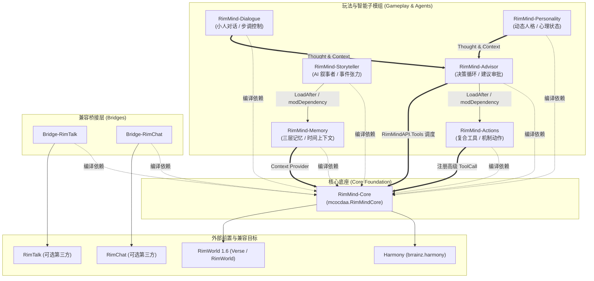

# RimWorld-RimMind-Mod

> **为 RimWorld 注入 AI 灵魂** —— 基于大语言模型（LLM）的多智能体动态叙事、人格塑造与自主决策模组套件。

[](https://rimworldgame.com/)
[](https://github.com/pardeike/Harmony)
[](https://dotnet.microsoft.com/)
[](LICENSE)

---

## 📖 关于 RimMind

**RimMind** 是一套面向 **RimWorld 1.6** 的模块化 AI 模组生态系统。通过将现代大语言模型（LLM）的多智能体协同技术与游戏原生机制深度结合，为边缘世界中的殖民者（Pawn）赋予深度的心理活动、长期记忆、自然语言对话和自主意图决策能力。

套件由 **1 个核心基础设施底座**、**6 大功能玩法模组** 与 **2 个第三方兼容桥** 组成。每个模组均可独立发布与选用，遵循严格的松耦合与单一职责原则。

---

## 🏛️ 系统架构与模块全景



---

## 📦 开源模组矩阵与仓库索引

所有模组均独立维护与发布，玩家可按需搭配使用（**RimMind-Core 为所有子模组的唯一共同前置**）：

### 核心底座 (Core)
| 仓库 | PackageId | 说明 |
|---|---|---|
| [**RimWorld-RimMind-Mod-Core**](https://github.com/RimWorld-RimMind-Mod/RimWorld-RimMind-Mod-Core) | `mcocdaa.RimMindCore` | 统一 LLM 请求管线、异步优先队列、上下文引擎、AgentBus、Tool 注册网关与公共 API |

### 玩法与决策模组 (Gameplay)
| 仓库 | PackageId | 说明 |
|---|---|---|
| [**RimWorld-RimMind-Mod-Advisor**](https://github.com/RimWorld-RimMind-Mod/RimWorld-RimMind-Mod-Advisor) | `mcocdaa.RimMindAdvisor` | AI 顾问决策循环：小人自主意图分析、玩家审批流与 Tool Calling 执行反馈闭环 |
| [**RimWorld-RimMind-Mod-Actions**](https://github.com/RimWorld-RimMind-Mod/RimWorld-RimMind-Mod-Actions) | `mcocdaa.RimMindActions` | 复合工具（Composite ToolCall）编排与 25+ 游戏机制高阶动作库 |
| [**RimWorld-RimMind-Mod-Personality**](https://github.com/RimWorld-RimMind-Mod/RimWorld-RimMind-Mod-Personality) | `mcocdaa.RimMindPersonality` | 殖民者动态心理状态评估、人格特质演变与原生 Thought 注入 |
| [**RimWorld-RimMind-Mod-Dialogue**](https://github.com/RimWorld-RimMind-Mod/RimWorld-RimMind-Mod-Dialogue) | `mcocdaa.RimMindDialogue` | 殖民者社交/事件拦截对话、玩家主动对话与对话节奏评估 |
| [**RimWorld-RimMind-Mod-Memory**](https://github.com/RimWorld-RimMind-Mod/RimWorld-RimMind-Mod-Memory) | `mcocdaa.RimMindMemory` | 三层记忆架构（活动/归档/潜意识暗记忆）与时序上下文持久化 |
| [**RimWorld-RimMind-Mod-Storyteller**](https://github.com/RimWorld-RimMind-Mod/RimWorld-RimMind-Mod-Storyteller) | `mcocdaa.RimMindStoryteller` | 基于世界张力与殖民地历史叙事线的 AI 动态事件叙事者 |

### 第三方兼容桥 (Bridges)
| 仓库 | PackageId | 说明 |
|---|---|---|
| [**RimWorld-RimMind-Mod-Bridge-RimTalk**](https://github.com/RimWorld-RimMind-Mod/RimWorld-RimMind-Mod-Bridge-RimTalk) | `mcocdaa.RimMindBridgeRimTalk` | 与 RimTalk 模组的对话门控协调、人设数据互通与上下文推送桥 |
| [**RimWorld-RimMind-Mod-Bridge-RimChat**](https://github.com/RimWorld-RimMind-Mod/RimWorld-RimMind-Mod-Bridge-RimChat) | `mcocdaa.RimMindBridgeRimChat` | 与 RimChat 模组的对话/动作互斥与上下文拉取桥 |

### 共享基础设施
| 仓库 | 说明 |
|---|---|
| [**Workflows**](https://github.com/RimWorld-RimMind-Mod/Workflows) | 跨仓库复用的 GitHub Actions 工作流（CI 测试矩阵与 AI 双语 Release Notes） |
| [**.github**](https://github.com/RimWorld-RimMind-Mod/.github) | 组织级配置、社区指引与 Issue/PR 模板 |

---

## 🔗 三维依赖设计规范

为了保证系统的健壮性与模组独立性，RimMind 严格区隔三个层面的依赖关系：

1. **C# 编译期程序集依赖（硬依赖）**：
   - 所有子模组均**仅引用 Core 输出的三个纯净程序集**（`0_RimMindDomain.dll`, `1_RimMindApplication.dll`, `2_RimMindCore.dll`）。
   - 子模组之间**绝对禁止**产生直接的 C# 项目工程引用或 DLL 互引。
2. **RimWorld 游戏加载顺序（`About.xml`）**：
   - 基础排序：`Harmony` → `RimMind - Core` → `各玩法子模组 (Actions/Memory/Personality/Dialogue)` → `Advisor` → `Storyteller` → `Bridge-RimTalk / Bridge-RimChat`。
3. **运行时数据流解耦**：
   - **Thought 状态通道**：Personality 与 Dialogue 将状态写入游戏原生 Thought，Advisor 仅通过 Core 提供的 Context Provider 异步感知，不直连对应模组类。
   - **ToolCall 抽象**：Advisor 仅调用 Core 的 `RimMindAPI.Tools`，具体动作由 Actions 注册。
   - **AgentBus 消息总线**：异步计算派发感知事件，主线程 tick 时安全消费并执行 Verse/Unity 副作用。

---

## 🚀 玩家与开发者指南

### 🎮 玩家安装与模组启用
1. 确保安装前置模组 **Harmony**。
2. 必须启用 **RimMind - Core**（核心底座）。
3. 按照个人喜好自由启用玩法子模组（如 Advisor 顾问、Dialogue 对话、Personality 人格等）。
4. 若同时安装了第三方对话模组（RimTalk / RimChat），请启用对应的 Bridge 模组以获得最佳协调体验。

### 🛠️ 开发者与贡献者
各模组作为独立 Git 仓库管理。贡献代码时，可直接克隆对应的模组仓库：

```bash
# 克隆核心仓库
git clone https://github.com/RimWorld-RimMind-Mod/RimWorld-RimMind-Mod-Core.git

# 或克隆指定玩法模组
git clone https://github.com/RimWorld-RimMind-Mod/RimWorld-RimMind-Mod-Advisor.git
```

编译测试要求：.NET 10 SDK（编译测试工程）与 .NET Framework 4.8（RimWorld 运行环境）。

```powershell
# 编译并运行模组测试
dotnet test Tests/RimMindCore.Tests.csproj -c Release
```

---

## 🤝 参与贡献

我们欢迎社区贡献！
- 提交 Bug 或需求：请前往对应模组的 [Issues](https://github.com/RimWorld-RimMind-Mod/RimWorld-RimMind-Mod-Core/issues)。
- 了解开发规范：请查阅各仓库根目录的 `AGENTS.md` 与 [CONTRIBUTING.md](CONTRIBUTING.md)。

---

*RimMind 是一个社区驱动的开源模组套件，遵循 MIT 开源协议，与 Ludeon Studios 无官方关联。*
